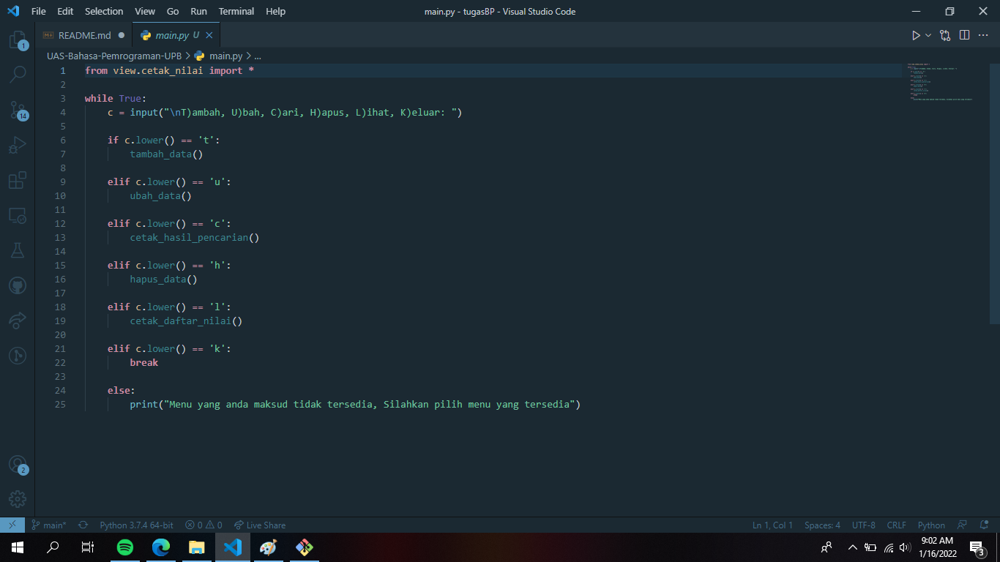
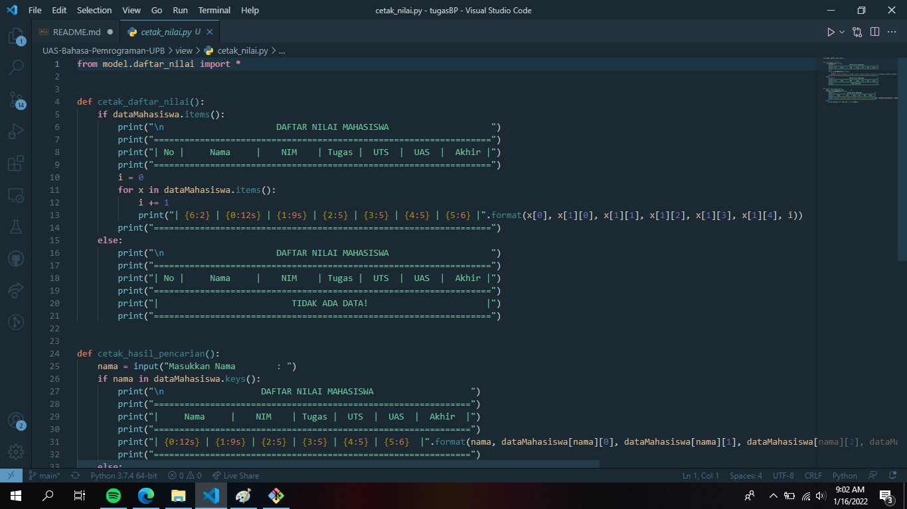
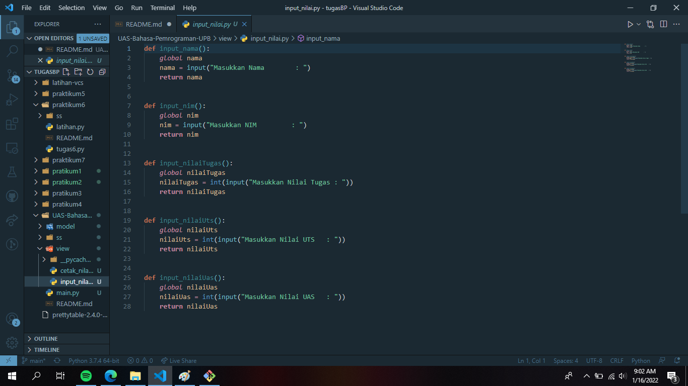
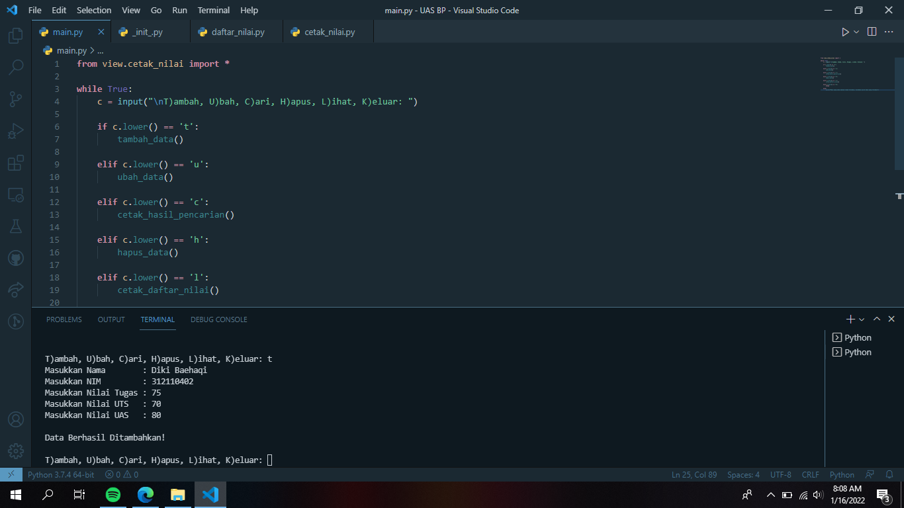
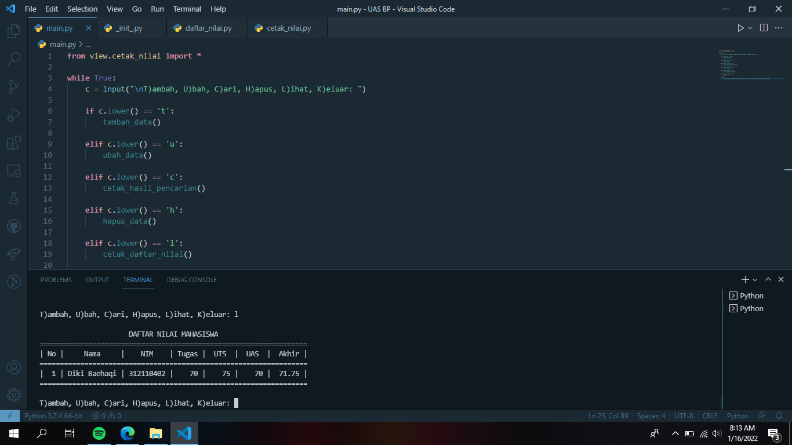
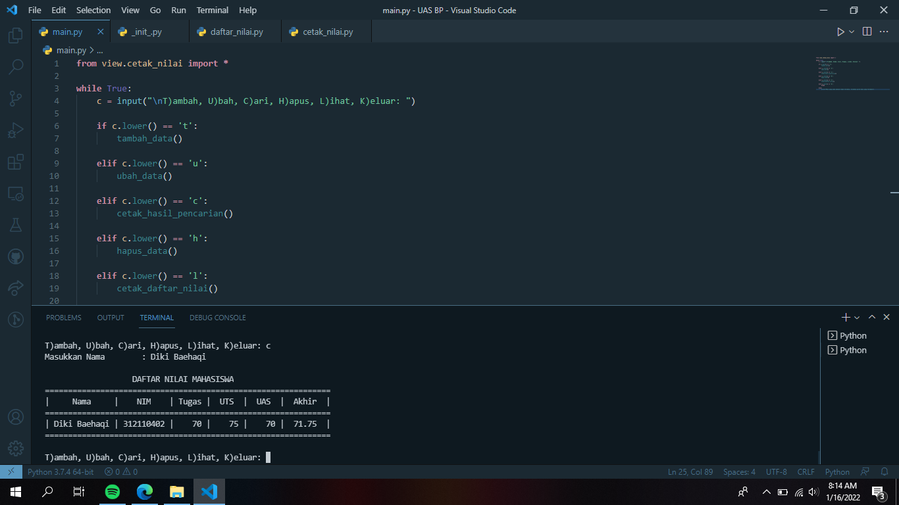
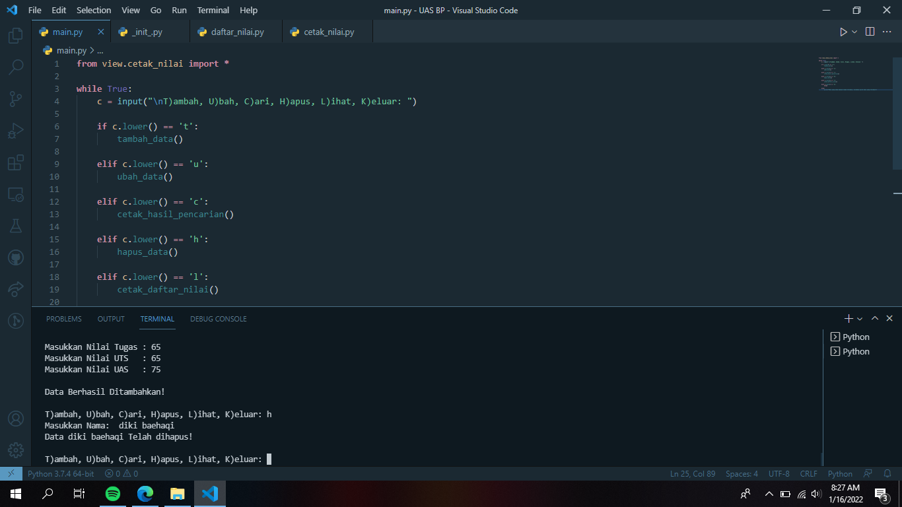

# UAS Bahasa Pemrograman-Python

## UAS Bahasa pemrograman
### Profil
Nama : Diki Baehaqi

Nim : 312110402

Kelas : TI.C1.21

### Membuat pacekage dan modul dengan struktur seperti berikut:

daftar_nilai.py berisi modul untuk tambah data, ubah data, cari data, hapus data -cetak_nilai.py berisi modul untuk cetak daftar nilai, cetak hasil pencarian -nput_nilai.py berisi modul untuk input data yang diminta pengguna untuk memasukkan data -main.py berisi program secara keseluruhan -Susunan package dan modul nya akan terlihat seperti di bawah ini

### source code program python 

### sc cetak_nilai.py

### sc daftar_nilai.py

### sc main.py

### sc inut_nilai.py

### menu Output tambah data

### menu Output lihat data

### menu Output cari data

### menu Output hapus data

TERIMAKASIH
